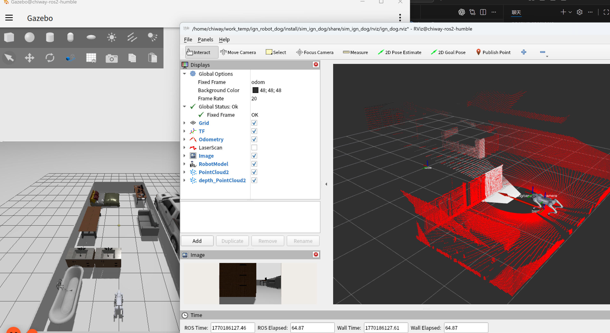

使用champ开源算法,实现宇树机器狗go2的ign-gazebo仿真
===
分支 ign_robot_dog_Agibot 为智元机器狗仿真
## 使用方式
- 配置环境变量
```
sudo nano ~/.bashrc
```
粘贴下列内容到文件末尾，保存并退出，然后执行`source ~/.bashrc`使配置生效
```
#ign模型路径
export IGN_GAZEBO_RESOURCE_PATH=ign_models  #相对路径
#export IGN_GAZEBO_RESOURCE_PATH=~/ign_models #绝对路径
```
- ign_gazebo节点
```
ros2 launch sim_ign_dog gazebo_sim_dog.launch.py 
```
- 控制节点
```
ros2 run teleop_twist_keyboard teleop_twist_keyboard
```

## 参考仓库
- [anujjain-dev/unitree-go2-ros2](https://github.com/anujjain-dev/unitree-go2-ros2.git)

- [chvmp/champ](https://github.com/chvmp/champ.git)


